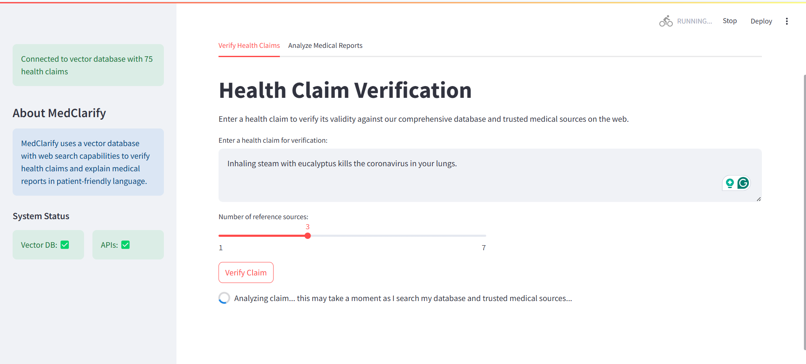
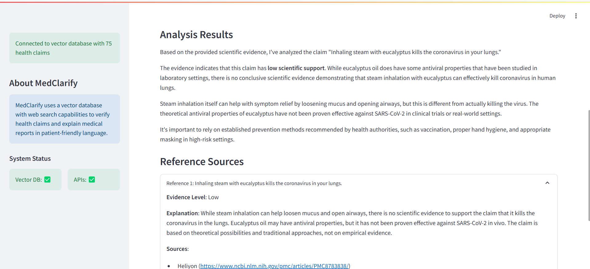
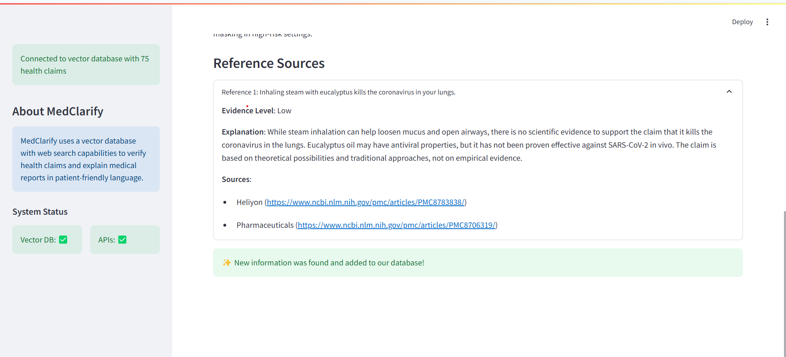
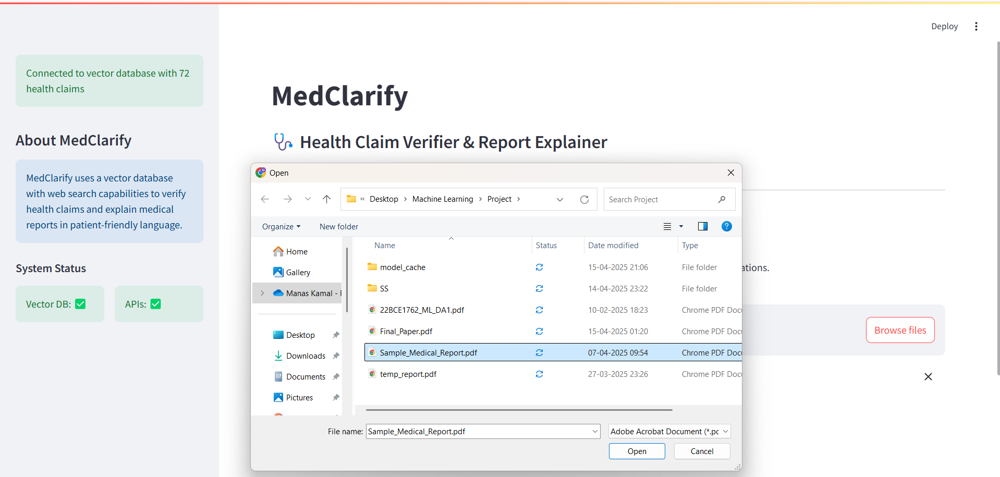
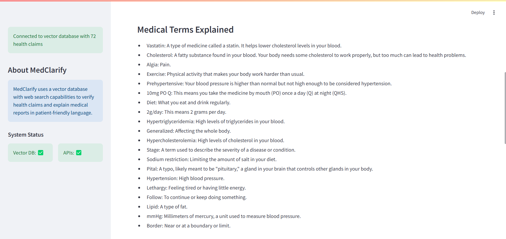
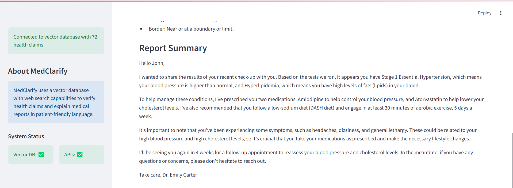
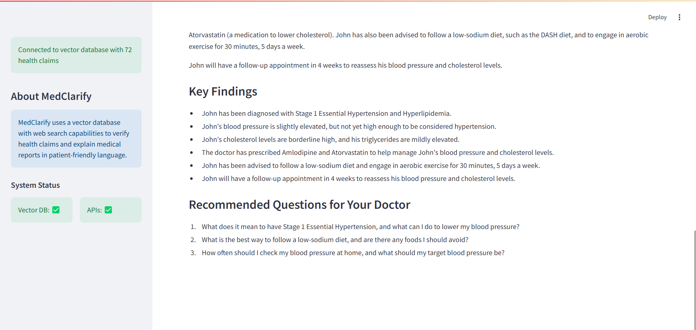

# MedClarify 🏥: A Healthcare GenAI Assistant for Health Claim Verification and Clinical Report Analysis

<div align="center">
  
</div>

> - A modular, domain-specialized artificial intelligence system designed to address distinct yet interconnected challenges in the medical domain through Health Claim Verification and Medical Report Analysis.
> - Leverages advanced LLMs (Large Language Models) and RAG (Retrieval Augmented Generation) for factually correct, well-grounded, user friendly responses

<table>
<tr>
<td width="50%" valign="top">
  
## 📋 Table of Contents
- [Overview](#-overview)
- [Problem Statement](#-problem-statement)
- [System Components](#️-system-components)
- [Health Claim Verification Module](#-health-claim-verification-module)
- [Medical Report Analysis Module](#-medical-report-analysis-module)
- [MedClarify UI Preview](#-medclarify-ui-preview)
- [Technology Stack](#️-technology-stack)
- [Data Sources](#-data-sources--knowledge-base)
- [Getting Started](#-getting-started)

</td>
<td width="50%" valign="top" align="center">

</td>
</tr>
</table>

## 🎯 Overview

MedClarify tackles two major challenges in healthcare:

1. **⚡ Inefficiencies and complexities** involved in manually verifying health claims
2. **📄 Difficulties in interpreting** dense medical documentation for non-specialist users, who don't understand complex medical jargon without expert consultation.

The system is built around **two principal components** that work together to make medical information more accessible while maintaining accuracy and reliability.

## 🚨 Problem Statement

### Current Challenges
- **⏰ Time-consuming** manual health claim verification processes
- **❌ Error-prone** manual interpretation of medical documents  
- **🚫 Inaccessible** medical information for non-specialists
- **🔍 Complex medical terminology** that's difficult to understand

### What MedClarify Solves
- Automates health claim verification with evidence-based analysis
- Transforms complex medical reports into patient-friendly summaries
- Provides reliable, source-backed medical information
- Bridges the gap between medical expertise and patient understanding

## 🏗️ System Components

MedClarify consists of **two strategically developed modules**:

```
┌─────────────────────────────────────────────────────────┐
│                    MedClarify System                    │
├─────────────────────┬───────────────────────────────────┤
│  🔍 Health Claim    |  📋 Medical Report Analysis      │
│     Verification    │      Module                       │
│     Module          │                                   │
└─────────────────────┴───────────────────────────────────┘
```

## 🔍 Health Claim Verification Module

### What is a health claim first of all?
A health claim refers to any statement that connects a particular food or food component to a potential health benefit or a reduced risk of disease. In essence, it describes a relationship between a food substance — such as a whole food, a nutrient, or a dietary supplement ingredient — and a specific health outcome. For example, manufacturers of oat-based cereals often claim that oat bran helps reduce cholesterol levels, thereby lowering the likelihood of developing serious heart conditions. Similarly, non-starchy vegetables are associated with a decreased risk of cardiovascular disease, while calcium intake is linked to the prevention of osteoporosis. Such claims are intended to guide consumers toward making informed dietary choices that promote long-term health and disease prevention.

### 🎯 Purpose
- The purpose of this "Health Claim Verification Module" of MedClarify is to verify these health-related claims by evaluating their scientific validity and evidence base, ensuring that statements about food, nutrition, or medical benefits are supported by credible research.
- It systematically analyzes published biomedical literature, clinical studies, and authoritative medical sources to determine whether a given health claim is factual, exaggerated, or misleading.
- It leverages **Mistral-7B-Instruct-v0.3** LLM within a **Retrieval-Augmented Generation (RAG) framework** to verify health claims using authoritative medical sources.
- By combining natural language understanding, evidence retrieval, and domain-specific reasoning, the assistant helps promote trustworthy health communication and empowers users to make informed, evidence-backed decisions about diet, wellness, and medical products.

### 🔄 How It Works

#### Step 1: Claim Input 📝
Users can submit various types of health queries/claims:
- **Specific assertions**: *"Dark chocolate improves cognitive function"*
- **Comparative statements**: *"Vitamin D is more effective than calcium for bone health"*, *"Covishield has better efficacy than Covaxin"*
- **General inquiries**: *"Garlic and health"*, *"Benefits and risks of intermittent fasting"*
- **Treatment queries**: *"Does garlic lower blood pressure?"*, *"Inhaling steam with eucalyptus oil can eliminate the coronavirus from the
lungs"*, *"Mixing Covaxin and Covishield vaccines may result in harmful side effects"*

#### Step 2: Semantic Search Retrieval 🔎
- Uses **Sentence Transformer** as the **Embedding Model**, which internally leverages the **MPNet-base Transformer** architecture to create semantic vector embeddings of the query
- Searches **Pinecone vector database** using vector similarity search (cosine similarity)
- Retrieves relevant passages from the curated medical knowledge base

#### Step 3: Web Search Retrieval 🌐
When internal database lacks relevant information:
- Activates **Google Search API** as fallback mechanism
- **Constrains searches** to predefined credible health sources only (websites like WHO, NIH, CDC, etc.)
- Forwards retrieved web content to the language model

#### Step 4: Claim Validation ✅
- **The Mistral-7B-Instruct-v0.3 LLM** processes all retrieved evidence
- Generates natural language response with **judgement on the health claim**
- **Strictly grounds decisions** in factual information from provided sources
- **Avoids speculation** - only evidence-based conclusions

#### Step 5: Structured Knowledge Storage 💾
For new information from web searches (i.e., not already present in the internal vector database), the system creates **structured JSON objects** that encapsulate the essence of the claim evaluation. These JSON objects include the original claim, an evidence level tag (e.g., High, Medium, Low), an explanatory reasoning passage summarising the model’s inference, and a list of source references with URLs. The JSON structure is illustrated as follows:

```json
{
  "health_claims": [{
    "claim": "Eating garlic lowers blood pressure",
    "evidence_level": "Medium",
    "explanation": "Some studies suggest that garlic supplementation may lead to modest reductions in blood pressure, particularly in individuals with hypertension. However, most research consists of small, preliminary, or low-quality studies, and more extensive research is needed to confirm these findings.",
    "sources": [
      {
        "name": "National Center for Complementary and Integrative Health",
        "url": "https://www.nccih.nih.gov/health/garlic"
      }
    ]
  }]
}
```
By organizing the information retrieved from the web into a well-defined JSON schema, MedClarify transforms raw, unstructured web content into distilled, high-utility **Knowledge Artefacts**.

These **Knowledge Artefacts** are stored in the **Pinecone Vector Database** and later used for reference in case of **semantically similar health queries in future**. Hence, it facilitates **Knowledge Reuse** as the previous LLM responses are stored, and the system doesn't need to re-initiate a full **web-retrieval-and-reasoning pipeline** — which involves performing another web search, extracting content, and invoking the LLM for reasoning across the web contents. The system can directly fetch the precomputed structured response, so that the LLM can refer to its previous response and doesn’t have to perform complex reasoning from scratch again and again.

### 🚀 Key Benefits
- **⚡ Avoids redundant processing** for similar future queries
- **🏃‍♂️ Accelerates inference time** through cached responses  
- **📊 Reduces server load** and computational overhead
- **🎯 Ensures consistency** across similar health claim queries
- **🔄 Promotes data reuse** and minimizes discrepancies from changing web content

## 📋 Medical Report Analysis Module

### 🎯 Purpose
- The purpose of this "Medical Report Analysis Module" of MedClarify is to interpret and summarize complex clinical documents into clear, comprehensible insights that support both healthcare professionals and patients in understanding key medical information.
- It employs advanced natural language processing (NLP) and domain-specialized generative AI techniques to extract critical details such as diagnoses, treatments, diseases, lab findings, and prognostic indicators from lengthy or technical reports.
- By transforming dense medical jargon into structured, human-readable summaries, this module enhances clinical transparency, aids in decision-making, and ensures that vital health information is accurate, concise, and easily accessible to all stakeholders in the healthcare process, including common people.
- It **bridges the gap** between complex clinical documentation and patient comprehension by automating extraction, explanation, and summarization of medical reports.

### 🔄 Multi-Stage Processing Pipeline

#### Step 1: PDF Text Extraction 📄
- Uses **PyPDF2 library** for robust text extraction
- **Maintains original formatting, structure, and contextual coherence**
- Preserves relationships between sections (diagnoses, findings, medications, diseases, observations)

#### Step 2: Named Entity Recognition (NER) 🏷️
- Processes extracted text with **BIOMed NER model** that leverages the **DeBERTaV3 Transformer Model** internally
- **Transformer-based biomedical NER framework** trained specifically for medical content
- **Detects and extracts** medically relevant entities:
  - 🦠 Diseases
  - 💊 Drug names  
  - 🩺 Treatment protocols
  - 🫀 Anatomical terms
  - 🤒 Symptoms
  - 🧪 Biomarkers
  - 🔬 Diagnostic procedures

#### Step 3: Medical Terminology Explanation 📚
- Uses **BioMistral-7B LLM** for domain-specialized explanations
- **Fine-tuned on medical literature and clinical data**
- Generates **medically reliable explanations** for extracted biomedical entities
- **Simplifies complex terms** without compromising factual integrity

#### Step 4: Comprehensive Summarization 📝
- **The Mistral-7B-Instruct-v0.3 LLM** processes complete medical content:
  - Original report text
  - Identified biomedical entities  
  - Generated explanations
- Creates **cohesive, concise, and conversational summary**
- **Preserves clinical relevance** while being accessible to patients
- Presents information in **reassuring format** for patient understanding

### 🎯 Final Output
- **Patient-friendly summary** displayed on user interface
- **Holistic and comprehensible overview** of medical reports
- **Clinical accuracy maintained** throughout the simplification process
- **Key Findings** about the patient's health from the report
- **Additional Questions** suggested for patients to ask their doctor

## 🛠️ Technology Stack

### Core Models
- **🤖 Mistral-7B-Instruct-v0.3**: Primary LLM for reasoning and generation
- **🧬 BioMistral-7B**: Medical domain-specialized model for terminology explanation
- **🏷️ BIOMed NER**: Transformer-based biomedical entity recognition
- **🔤 Sentence Transformer**: Semantic embedding generation

### Infrastructure
- **🗄️ Pinecone**: Vector database for knowledge storage and retrieval
- **🔍 Google Search API**: Web search fallback mechanism  
- **📄 PyPDF2**: PDF document text extraction library

### Data Format
- **📋 JSON structured output** for machine-readable results
- **🔗 Source attribution** with URLs and citations
- **📊 Evidence level tagging** (High, Medium, Low)


## 🤖 MedClarify UI Preview
The following images showcase MedClarify in action for both tasks -

### Health Claim Verification
<p align="center">
  
</p>

<p align="center">
  
</p>

<p align="center">
  
</p>

*User enters a claim stating "Inhaling steam with eucalyptus kills the coronavirus in your lungs", and the system verifies it whether it is a scientifically-backed medical fact.*

---

### Clinical Report Analysis
<p align="center">
  
</p>

<p align="center">
  
</p>

<p align="center">
  
</p>

<p align="center">
  
</p>

*User enters a clinical report, and the system analyses and summarizes it, including the key findings about the patient's health and suggested additional questions for the patient.*


## 📚 Data Sources & Knowledge Base

The system is **anchored to authoritative medical domains** including:

- **🏛️ Centers for Disease Control and Prevention (CDC)**
- **🌍 World Health Organization (WHO)**  
- **🔬 National Institutes of Health (NIH)**
- **📖 National Center for Biotechnology Information (NCBI)**
- **➕ Additional trusted medical and public health sources**

This ensures **verifiably grounded responses** in credible evidence and maintains the highest standards of medical accuracy.

## 🚀 Getting Started

### Health Claim Verification
1. **📝 Submit your health claim** or question
2. **⏳ Wait for semantic search** through medical knowledge base
3. **📊 Receive evidence-based assessment** with source citations
4. **💾 System stores structured knowledge** for future similar queries

### Medical Report Analysis  
1. **📤 Upload your PDF medical report**
2. **🔍 System extracts and analyzes** medical entities
3. **📚 Receives explanations** of medical terminology
4. **📋 Get patient-friendly summary** of your report

## 💡 Key Features

### Health Claim Verification ✅
- **🎯 Evidence-based claim assessment** 
- **📊 Confidence levels** (High/Medium/Low)
- **🔗 Direct source citations** with URLs
- **💾 Intelligent knowledge caching** for efficiency
- **🌐 Fallback web search** for comprehensive coverage

### Medical Report Analysis 📄
- **📝 Robust PDF text extraction**
- **🏷️ Advanced biomedical entity recognition**  
- **📚 Plain-language medical term explanations**
- **👥 Patient-centered report summaries**
- **🎯 Clinical accuracy preservation**

---

**⚠️ Disclaimer**: MedClarify is designed to assist with medical information analysis and should not replace professional medical advice. Always consult healthcare providers for medical decisions.
